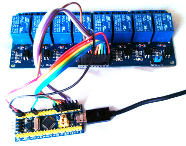
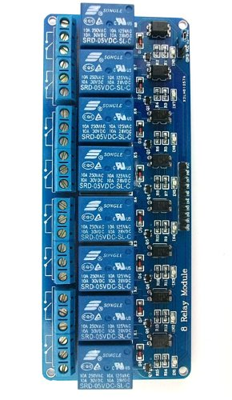

usb-relay - USB relay control module
====================================

usb-relay is a quick 'n dirty relay controller based on two very cheap
off-the-shelf boards.

Quickstart for STM32F103 boards
-------------------------------

- Install the [Arm Embedded
  Toolchain](https://developer.arm.com/open-source/gnu-toolchain/gnu-rm)
  (or similar arm-none-eabi- compiler), openocd and dfu-util.
- Clone this repo:
  `git clone https://github.com/daniel-thompson/usb-relay.git`
- Fetch the libraries:
  `cd usb-relay; git submodule update --init --recursive`
- Build the firmware:
  `make`
- Use JTAG/SWD programmer to install the booloader. Either
  `make -C src/bootloader flash` for STLink v2 or
  `make -C src/bootloader BMP_PORT=/dev/ttyACM0 flash` for a Black Magic Probe.
- Use the bootloader to install the main application using the microcontroller
  board's own USB socket:
  `make -C src/stm32f1-relay flash`

Hardware setup
--------------

The firmware can be easily ported but has been most heavily tested on
STM32F103C8T6 based breakout boards. Connections required are:

- USB to host computer
- 5v and GND to relay board
- GPIOB 12-15  ->  relay 1-4
- GPIOA  8-10  ->  relay 5-7
- GPIOB  6     ->  relay 8

All the GPIO connections are on one side of the controller board (and the
first seven are sequentially allocated).

Alternative boards
------------------

- [Carbon by Seeed and 96Boards](src/stm32f4-relay-96bcarbon/README.md).
- STM32F4-Discovery (undocumented)
- Most STM32F103 breakout boards have jumpers enabling them to
  permanently assert USB hotplug. If your board does not do this then you
  will likely have to configure a GPIO pin to assert hotplug.  usb-relay
  does not contain code for this. Adding it is an exercise for the
  reader!

Usage
-----

The firmware registers itself as a CDC-ACM device and, under Linux, will
be presented as ttyACMx where x is typically 0 on "simple" machines
although will be larger if there is any USB communication or modem device
installed (for example an unused 3G modem).

Type `help` to get a list of available commands. On STM32F1 platforms
the commands available are:

- `echo` - test command that echos back its input
- `id` - reports a unique device serial number (the same number is also
  reported as the USB serial number)
- `help` - shows a list of commands
- `led` - manipulate the LED on the board (for testing, takes the same
  arguments as the relay command)
- `reboot` - reboot into DFU mode to allows a firmware upgrade (firmware
  upgrade mode can also be triggered by resetting the board whilst leaving
  it plugged into the host)
- `relay1` to `relay8` - can be used to turn the relay
  on or off as well as toggling its state or sending a 1 second pulse
- `version` - reports firmware version and build date
- `uptime` - show time since power on

udev rules
----------

The firmware uses the STM32 unique device ID to provide every physical
instance with a unique serial number. This allows udev rules to be
introduced to ensure stable device enumeration regardless of any changes
to the USB topology.

    SUBSYSTEM=="tty", ATTRS{manufacturer}=="redfelineninja.org.uk", ATTRS{serial}=="045101780587252555FFC660", SYMLINK+="ttyrelayC660"
    SUBSYSTEM=="tty", ATTRS{manufacturer}=="redfelineninja.org.uk", ATTRS{serial}=="7301C2152B72E52DE2744F3B", SYMLINK+="ttyrelay4F3B"

The serial number can picked up from the kernel log (`dmesg`) or using udevadm:
`udevadm info --attribute-walk /dev/ttyACM0 | grep serial` .

udevadm can also be used to re-apply the rule if any changes are made to the symlink: `sudo udevadm trigger /dev/ttyACM0`

Example hardware
----------------

usb-relay should readily port to most STM32-based microcontroller boards.
However the following example hardware is easily (and cheaply) availabe and
will work out-of-the-box.

[STM32F103C8T6 microcontroller development board](http://item.taobao.com/item.htm?spm=a1z10.1.w4004-386456545.4.3eifcC&id=22097803050) from vcc-gnd.com. Normally very easy to source on eBay.

[Eight channel relay board](http://hobbycomponents.com/relays/88-8-channel-5v-relay-module) from specialist supplier (or eBay)

